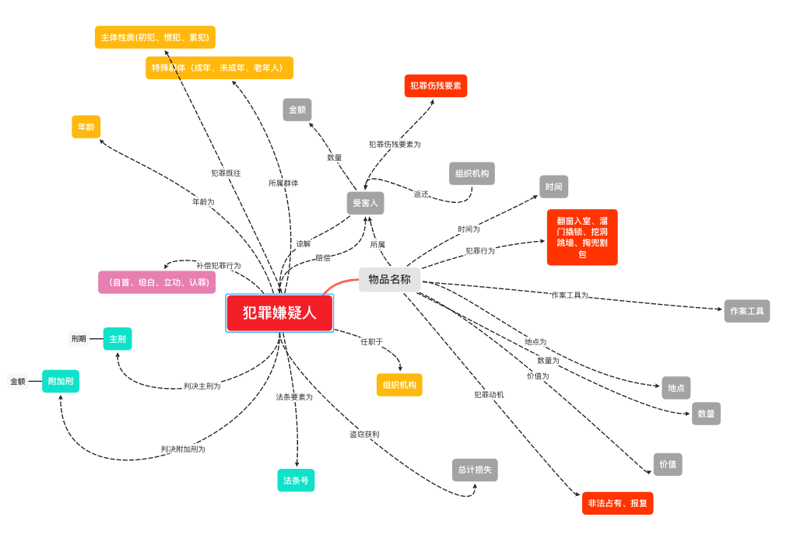
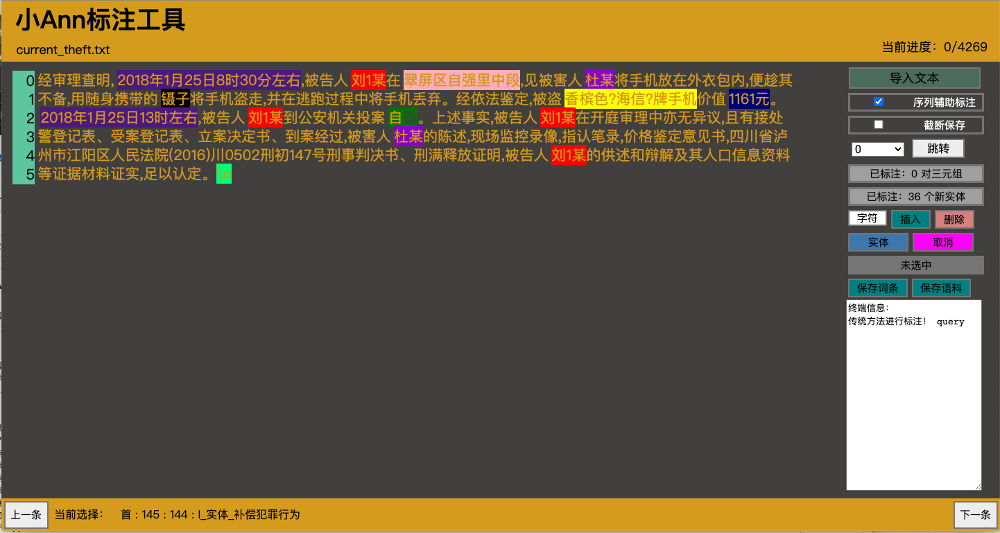
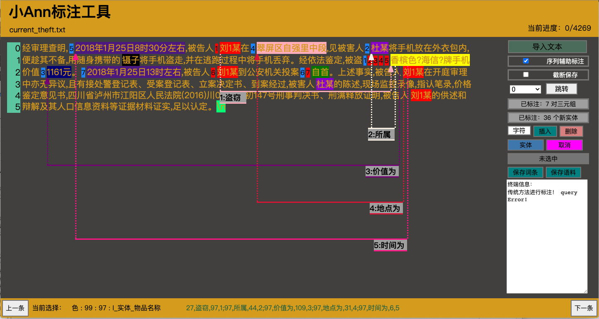
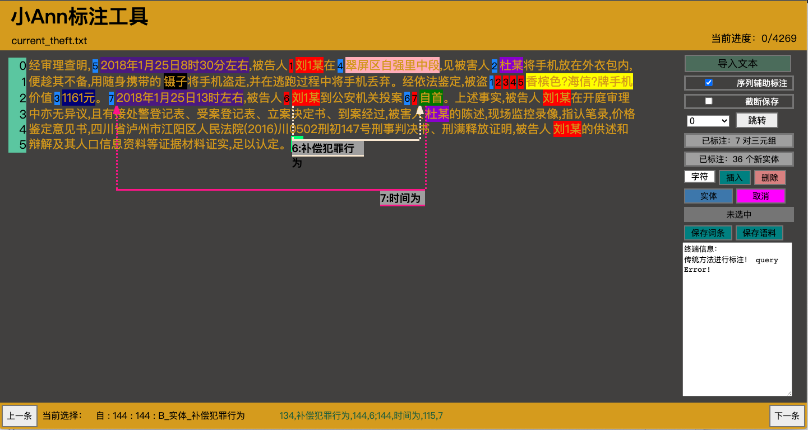

## 标注过程详解
将对应文件clone下来后，进入LAnn文件夹中，利用浏览器打开小Ann，利用"导入文本"==>导入数据。

## 标注工具
- 鼠标进行选择
选中文本默认情况下是会弹出实体类型的，但若并未出现按s

- 类似vim操作中进行
"空格":开始连接
"h":向左移动一个光标
"j":向下移动一个光标
"k":向上移动一个光标
"l":向右移动一个光标
"s":保存实体类型
"q":取消标注
"n":下一页
"b":上一页

**相关工具介绍见LAnn文件夹**

## 标注过程详解

### 参考标准

==不一定能囊括所有，例如“支付宝”就看做物品，有看到盗窃手机后利用支付宝进行消费的，发挥主观能动性==
### 进行实体标注标注

**犯罪动机一般可以分为两种占有为目的，报复 **
==如上所示，对实体标注标注较为直接，只需按照标注实例中所包含的要素进行标注，注谅解、赔偿、返回等归纳为关系不需要标注==

### 进行关系标注

